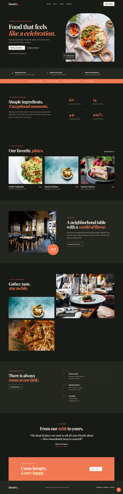

# Savorly

A modern and responsive restaurant website built with **HTML, CSS, and JavaScript**.

## Features

- Responsive restaurant website
- Modern and clean UI
- Light/Dark Mode
- Restaurant menu section
- Interactive elements with JavaScript
- Mobile-friendly design
- Custom favicon

## Technologies Used

- HTML5
- CSS3
- JavaScript

## Screenshots

## Getting Started

1. Clone the repository.
2. Open `index.html` in your browser.
3. Explore the Savorly restaurant website.